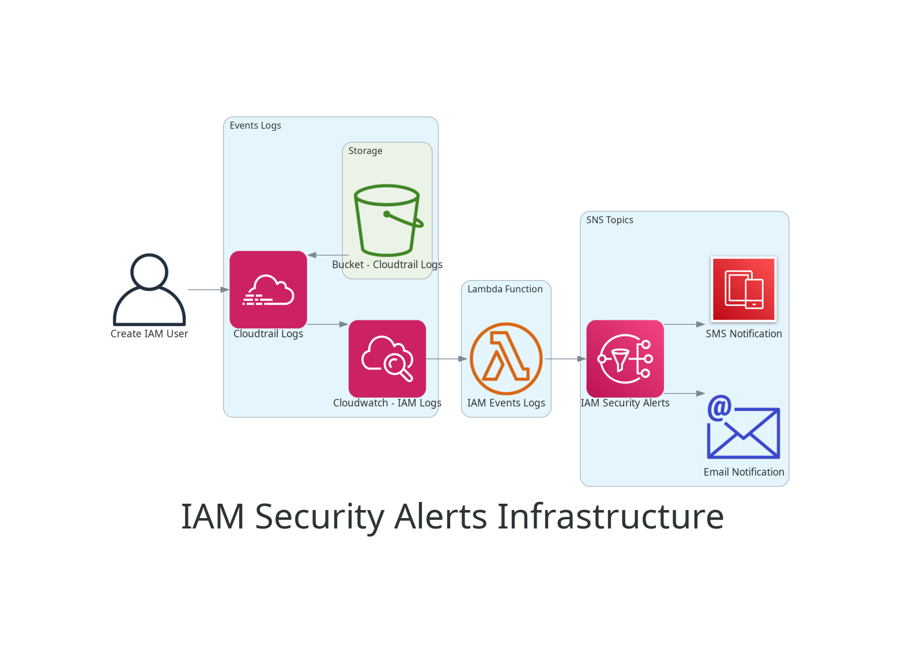

# <font color="orange">Terraform Module to Alert IAM Resources use</font>

---



## 📌 <font color="purple">🎯 Overview</font>

This repository is designed to deploy AWS security monitoring alert system with terraform module

## Table of Contents

<details><summary></a></summary>

- [AWS Security Monitoring Solution](#aws-security-monitoring-solution)
- [Architecture](#architecture)
- [Prerequisites](#prerequisites)
- [Overall Cost](#overall-cost)
- [Directory Structure](#directory-structure)
  - [CloudWatch](#cloudwatch)
  - [Lambda](#lambda)
  - [Provider](#provider)
  - [S3 bucket](#s3-bucket)
  - [SNS](#sns)
  - [Variables](#variables)
  - [Data](#data)
  - [Outputs](#outputs)
- [Deployment Instructions](#deployment-instructions)
  - [From Terraform Registry](#from-terraform-registry)
  - [From Source](#from-source)
- [Cleanup](#cleanup)
- [Troubleshooting](#troubleshooting)
   </details>

## <font color="purple"> 🛠️ AWS Security Monitoring Solution</font>

This solution provides automated security monitoring for your AWS environment,
using Lambda and EventBridge resources, to monitor and alert on
critical security events including IAM user creation, access key creation,
S3 bucket policy changes, and security group modifications.

## <font color="purple">Architecture</font>

The solution consists of:

- AWS Lambda function (Python) for processing security events
- CloudTrail for logging AWS API activity
- EventBridge(CloudWatch) rules for capturing specific security events
- SNS topic for sending notifications (email/sms)
- IAM roles and policies for secure operation
- S3 bucket for storing CloudTrail logs (mendatory for CloudTrail)

## <font color="purple">🔧 Prerequisites</font>

- AWS CLI configured with appropriate credentials
- Terraform >= 5.86.0
- Python 3.12 or later for the lambda function
- An AWS account with sufficient permissions to create the required resources

## <font color="purple">Overall Cost</font>

Checked the cost of this solution with [infracost](https://www.infracost.io/)
total estimated monthly cost is listed in `'infracost'` folder,
in Json and HTML format

## <font color="purple">Directory Structure</font>

```bash
.
├── .vscode/
│   ├── extensions.json
│   ├── launch.json
│   ├── tasks.json
│   └── settings.json
├── diagrams/
│   ├── requirements.txt
│   ├── terraform_diagram.png
│   ├── terraform_diagram.py
├── documentation/
│   ├── SECURITY.md
│   ├── TESTING.md
│   ├── DEBUGGING.md
│   ├── LIMITATIONS.md
│   ├── TODO.md
│   └── TOOLS.md
├── function/
│   ├── lambda_function.py
│   ├── lambda_payload_CreateUser.json
│   └── rag_db_query.py
├── infracost/
├── modules/
│   ├── cloudtrail.tf
│   ├── cloudwatch.tf
│   ├── data.tf
│   ├── lambda.tf
│   ├── opensearch.tf
│   ├── outputs.tf
│   ├── providers.tf
│   ├── s3_bucket.tf
│   ├── sns.tf
│   └── variables.tf
├── .gitignore
├── .gitkeep
├── .gitleaks.toml
├── .markdownlint.json
├── .pre-commit-config.yaml
├── .secrets.baseline
├── .talismanrc
├── .terraform-docs.yml
├── .tflint.hcl
├── main.tf
├── outputs.tf
├── README.md
├── secrets.tfvars
├── variables.tf

```

### CloudWatch

cloudwatch.tf = Build CloudWatch resource

### Lambda

lambda_function.py = Lambda Function
lambda_function.tf = Build Lambda Function in AWS
lambda_function.zip = lambda function zip (after running terraform plan)

### Provider

providers.tf = Provider information for the project

### S3 bucket

s3_bucket.tf = S3 Bucket configuration

### SNS

sns.tf = SNS Topic configuration

### Variables

variables.tf = Variables for the project resources

### Data

data.tf = Data information for the resources

### OpenSearch

opensearch = OpenSearch configuration

## <font color="purple">Deployment Instructions</font>

### From Terraform Registry

1. Update variables in `variables.tf` if needed
2. add main.tf

```json
module "iam_security_events" {
  source                              = "./modules/"
  aws_access_key                      = var.aws_access_key
  aws_secret_key                      = var.aws_secret_key
  environment                         = var.environment
  project_owner                       = var.project_owner
  project_name                        = var.project_name
  enable_notification_email           = var.enable_notification_email
  notification_email                  = var.notification_email
  enable_notification_phone           = var.enable_notification_phone
  notification_phone                  = var.notification_phone
  enable_opensearch                   = var.enable_opensearch
  aws_opensearch_domain_instance_type = var.aws_opensearch_domain_instance_type
  cloudwatch_log_retention_days       = var.cloudwatch_log_retention_days
  lambda_function_log_retention_days  = var.lambda_function_log_retention_days
  lambda_function_timeout             = var.lambda_function_timeout
  opensearch_master_user_name         = var.opensearch_master_user_name
  opensearch_master_user_password     = var.opensearch_master_user_password
  opensearch_ebs_volume_size          = var.opensearch_ebs_volume_size
  enable_user_actions                 = true  # default(false)
  enable_group_actions                = true  # default(false)
  enable_user_accesskey_actions       = false # default(false)
}
```

1. Update variables in `secret.tfvars` if needed
2. Initialize Terraform:

   ```bash
   terraform init
   ```

3. Review the planned changes:

   ```bash
   terraform plan -var-file="secret.tfvars" -out=plan-out
   ```

4. Apply the configuration:

   ```bash
   terraform apply "plan-out"
   ```

### From Source

1. Clone this repository
2. Update variables in `variables.tf` if needed
3. Update variables in `secret.tfvars` if needed
4. Initialize Terraform:

   ```bash
   terraform init
   ```

5. Review the planned changes:

   ```bash
   terraform plan -var-file="secret.tfvars" -out=plan-out
   ```

6. Apply the configuration:

   ```bash
   terraform apply "plan-out"
   ```

7. Subscribe to the SNS topic (the ARN will be in the Terraform outputs)

## <font color="purple">Cleanup</font>

To remove all created resources:

```bash
terraform destroy -var-file="secret.tfvars" -auto-approve
```

### Post Setup

- approve the email from AWS "AWS Notification - Subscription Confirmation"
  by clicking the link in the email `SubscribeURL`

## <font color="purple">Troubleshooting</font>

Common issues and solutions:
creating or destroying OpenSearch resource could take up to 20m

## <font color="purple">Documentation</font>

---

### [Security Documentation](./documentation/SECURITY.md)

### [Testing Documentation](./documentation/TESTING.md)

### [Debugging Documentation](./documentation/DEBUGGING.md)

### [Limitations Documentation](./documentation/LIMITATIONS.md)

### [Todo Documentation](./documentation/TODO.md)

### [Tools Documentation](./documentation/TOOLS.md)

<!-- BEGIN_TF_DOCS -->
## Requirements

| Name | Version |
|------|---------|
| <a name="requirement_terraform"></a> [terraform](#requirement\_terraform) | >= 1.10.5 |

## Providers

No providers.

## Modules

| Name | Source | Version |
|------|--------|---------|
| <a name="module_iam_security_events"></a> [iam\_security\_events](#module\_iam\_security\_events) | ./modules/ | n/a |

## Resources

No resources.

## Inputs

| Name | Description | Type | Default | Required |
|------|-------------|------|---------|:--------:|
| <a name="input_aws_access_key"></a> [aws\_access\_key](#input\_aws\_access\_key) | AWS access\_key, admin login permissions to AWS resources | `string` | n/a | yes |
| <a name="input_aws_opensearch_domain_instance_type"></a> [aws\_opensearch\_domain\_instance\_type](#input\_aws\_opensearch\_domain\_instance\_type) | aws opensearch domain instance type | `string` | `"t3.small.search"` | no |
| <a name="input_aws_secret_key"></a> [aws\_secret\_key](#input\_aws\_secret\_key) | AWS secret\_key, admin login permissions to AWS resources | `string` | n/a | yes |
| <a name="input_cloudwatch_log_retention_days"></a> [cloudwatch\_log\_retention\_days](#input\_cloudwatch\_log\_retention\_days) | Number of days to retain CloudWatch logs | `number` | `14` | no |
| <a name="input_enable_group_actions"></a> [enable\_group\_actions](#input\_enable\_group\_actions) | Enable/Disable group actions lambda function for cloudwatch events rule | `bool` | `false` | no |
| <a name="input_enable_notification_email"></a> [enable\_notification\_email](#input\_enable\_notification\_email) | Enable/Disable user email address notifications | `bool` | `true` | no |
| <a name="input_enable_notification_phone"></a> [enable\_notification\_phone](#input\_enable\_notification\_phone) | Enable/Disable user phone address notifications | `bool` | `false` | no |
| <a name="input_enable_opensearch"></a> [enable\_opensearch](#input\_enable\_opensearch) | Enable/Disable OpenSearch for monitoring logs from CloudTrail | `bool` | `false` | no |
| <a name="input_enable_user_accesskey_actions"></a> [enable\_user\_accesskey\_actions](#input\_enable\_user\_accesskey\_actions) | Enable/Disable user accesskey actions lambda function for cloudwatch events rule | `bool` | `true` | no |
| <a name="input_enable_user_actions"></a> [enable\_user\_actions](#input\_enable\_user\_actions) | Enable/Disable user actions lambda function for cloudwatch events rule | `bool` | `true` | no |
| <a name="input_environment"></a> [environment](#input\_environment) | AWS Environment (Development, Testing, Staging, Production) | `string` | `"Testing"` | no |
| <a name="input_lambda_function_log_retention_days"></a> [lambda\_function\_log\_retention\_days](#input\_lambda\_function\_log\_retention\_days) | Number of days to retain CloudWatch logs | `number` | `7` | no |
| <a name="input_lambda_function_timeout"></a> [lambda\_function\_timeout](#input\_lambda\_function\_timeout) | Timeout for lambda function | `number` | `30` | no |
| <a name="input_notification_email"></a> [notification\_email](#input\_notification\_email) | List user email address notifications | `list(string)` | `[]` | no |
| <a name="input_notification_phone"></a> [notification\_phone](#input\_notification\_phone) | List user phone number notifications | `list(string)` | `[]` | no |
| <a name="input_opensearch_ebs_volume_size"></a> [opensearch\_ebs\_volume\_size](#input\_opensearch\_ebs\_volume\_size) | Set opensearch ebs volume size | `number` | `10` | no |
| <a name="input_opensearch_master_user_name"></a> [opensearch\_master\_user\_name](#input\_opensearch\_master\_user\_name) | Set opensearch user name login | `string` | `"admin"` | no |
| <a name="input_opensearch_master_user_password"></a> [opensearch\_master\_user\_password](#input\_opensearch\_master\_user\_password) | Set opensearch user name login password | `string` | `"admin1admin1"` | no |
| <a name="input_project_name"></a> [project\_name](#input\_project\_name) | set the tag for name of the project | `string` | `null` | no |
| <a name="input_project_owner"></a> [project\_owner](#input\_project\_owner) | set the tag for environment project owner name, a person or depatment | `string` | `null` | no |

## Outputs

| Name | Description |
|------|-------------|
| <a name="output_aws_region"></a> [aws\_region](#output\_aws\_region) | AWS region |
| <a name="output_cloudwatch_log_group_name"></a> [cloudwatch\_log\_group\_name](#output\_cloudwatch\_log\_group\_name) | Name of the CloudWatch Log Group |
| <a name="output_iam_management"></a> [iam\_management](#output\_iam\_management) | Identity and Access Management |
| <a name="output_lambda_function_name"></a> [lambda\_function\_name](#output\_lambda\_function\_name) | Lambda function name |
| <a name="output_lambda_log_group_retention_in_days"></a> [lambda\_log\_group\_retention\_in\_days](#output\_lambda\_log\_group\_retention\_in\_days) | Number of retention days for lambda log group |
| <a name="output_opensearch_domain_name"></a> [opensearch\_domain\_name](#output\_opensearch\_domain\_name) | opensearch domain name |
| <a name="output_opensearch_url"></a> [opensearch\_url](#output\_opensearch\_url) | opensearch url |
| <a name="output_s3_bucket_domain_name"></a> [s3\_bucket\_domain\_name](#output\_s3\_bucket\_domain\_name) | Domain name of the S3 bucket for logs |
| <a name="output_s3_bucket_id"></a> [s3\_bucket\_id](#output\_s3\_bucket\_id) | Id of the S3 bucket for logs |
| <a name="output_s3_bucket_name"></a> [s3\_bucket\_name](#output\_s3\_bucket\_name) | Name of the S3 bucket for logs |
| <a name="output_sns_topic_name"></a> [sns\_topic\_name](#output\_sns\_topic\_name) | SNS topic name |
<!-- END_TF_DOCS -->
